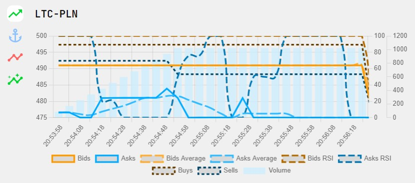

# streams21
Przetwarzanie strumieni danych

# running
Requires Node.js (created on v14.16.1)
1. `cd app` `npm install` `npm run build` (first build Svelte files)
2. `cd ../` `npm install` `npm run start` (then run the server)

# developing

## backend
Written in Express.js \
`npm install` `npm run start` (runs `node index.js`)

## frontend
Written in Svelte \
`cd app` `npm install` `npm run dev` (compiles frontend files on save)
